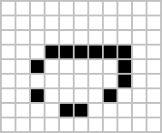

# Game of Life

In this repository you can find a classic Game of Life, written in C and using <ncurses.h> library.
The game supports reading pattern files via arguments. Simply run it like this:

    ./game_of_life pattern.txt

where *pattern.txt* is a file, containing the initial state of the field.

The field's width is 80 characters and the height is 25 characters. Control keys:
- <kbd>Q</kbd> - stop
- <kbd>A</kbd> - speed up
- <kbd>Z</kbd> - speed down

## About the game ([Wiki](https://en.wikipedia.org/wiki/Conway%27s_Game_of_Life)) 

 The Game of Life, also known simply as Life, is a cellular automaton devised by the British mathematician John Horton Conway in 1970. It is a zero-player game, meaning that its evolution is determined by its initial state, requiring no further input. One interacts with the Game of Life by creating an initial configuration and observing how it evolves.

### Patterns
Many different types of patterns occur in the Game of Life, which are classified according to their behaviour. Common pattern types include: **still lifes**, which do not change from one generation to the next; **oscillators**, which return to their initial state after a finite number of generations; and **spaceships**, which translate themselves across the grid.

Below you can find the most popular patterns:

| Still lifes | Oscillators | Spaceships |
| :---: | :---: | :---: |
|    *Block* |    *Blinker* *(period 2)* |    *Glider* |
|    *Bee-hive* |    *Toad* *(period 2)* |    *Light-weight spaceship (LWSS)* |
|    *Loaf* |    *Beacon* *(period 2)* |    *Middle-weight spaceship (MWSS)* |
|    *Boat* |    *Pulsar* *(period 3)* |    *Heavy-weight spaceship (HWSS)* |
|    *Tub* |    *Penta-decathlon* *(period 15)* |  |

## Installation

Ncurses library is already installed on MacOS by dafault. To install library on Linux, run:

    sudo apt-get install libncurses5-dev libncursesw5-dev
